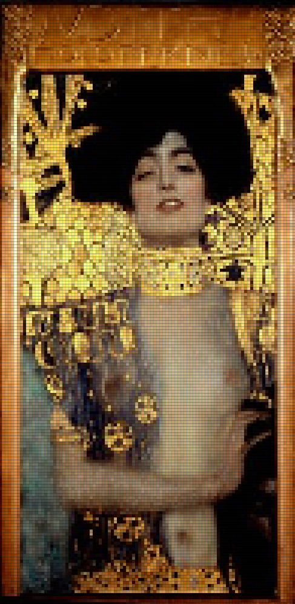
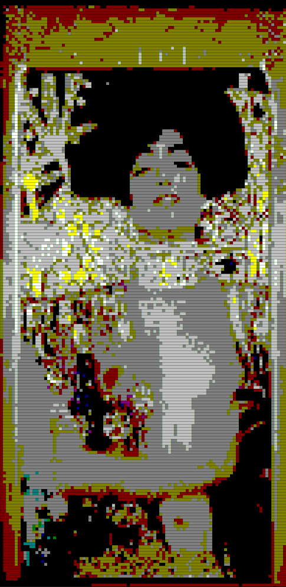
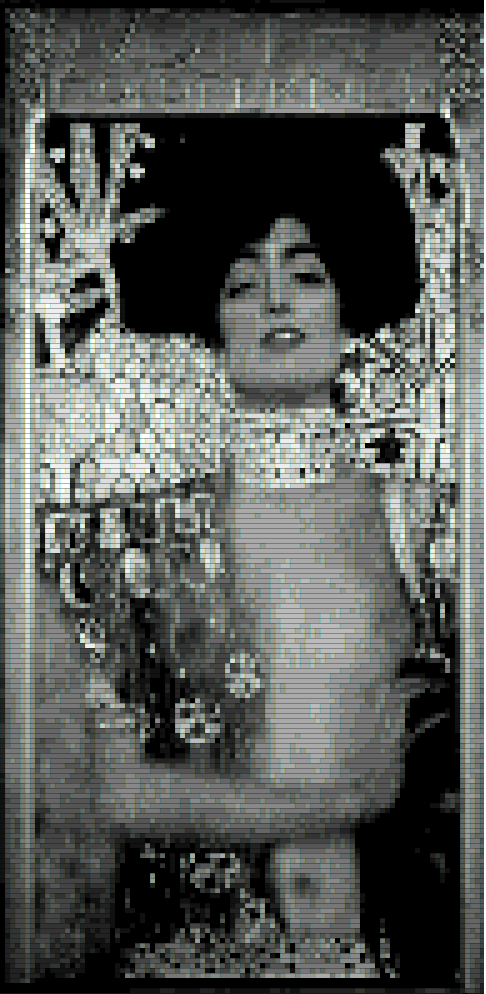
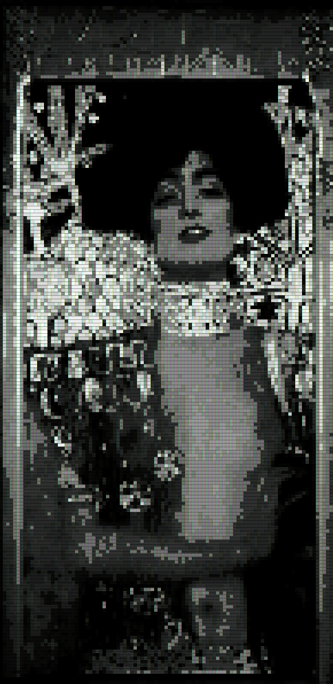
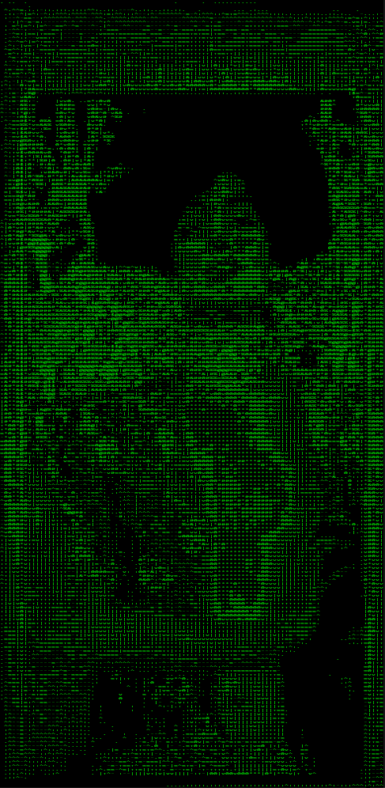

# Command Line Graphics Library

## 📃 Table of contents

- ***[What is this?](##❓-What-is-this?)***
- ***[Why?](##❓-Why?)***
- ***[Features](##🤩-Features)***
- ***[Performance](##💪-Performance)***
- ***[How to use?](##❓-How-to-use?)***
- ***[Showcase](##🌟Showcase)***
    - *[Drawables](###✏️-Drawables)*
    - *[Alpha compositing and color blending](###🅰️-Alpha-compositing-and-color-blending)*
    - *[Drawers](###🖍️-Drawers)*
- ***[Future](##🤖-Future)***

## ❓ What is this?

CLGL is a 2D graphics library that runs entirely in Windows' Command Prompt. It's main goal is to abstract all the nitty gritty WinAPI details and provide a nice and friendly developer experience.

## ❓ Why?

I made this project to learn a bit about graphics. *Also just felt like making it* 💅

## 🤩 Features

* 🌈 **Full RGB support**

* ✏️ **Many drawables**

    - *Point*
    - *Line*
    - *Circle*
    - *Polygon*
    - *Sprite*
    - *[You can also create your own drawables and easily adapt them to be usable with the library]*

* 🔄️ **Affine transformations for polygons and sprites**

* 🅰️ **Alpha compositing and color blending**

* 🖍️ **Custom drawers (filters) and [color palettes](tools/color_mappings_creator/README.md)**

* ⌨️ **User input handling**

* ⏰ **Timing utilities**

## 💪 Performance

The library takes some considerations to try to be as efficient as possible. However the main performance bottleneck in most cases will be the Command Prompt itself. Unfortunately I can't really do anything about it. From my observations, The less the colors, that have to be drawn to the console, differ, the faster the console will refresh, so keep that in mind

## ❓ How to use?

Example usage of the library can be found ***[here](clgl/examples)***. Unfortunately as of now, there is no documentation.

## 🌟 Showcase

### ✏️ Drawables

### 🅰️ Alpha compositing and color blending

### 🖍️ Drawers

<table style="width: 100%; align: center;">
  <tr>
    <th>Drawer</th>
    <th>Result</th>
  </tr>
  <tr>
    <td>FullRGB</td>
    <td></td>
  </tr>
  <tr>
    <td>Colors16</td>
    <td></td>
  </tr>
  <tr>
    <td>Colors16Grayscale</td>
    <td></td>
  </tr>
  <tr>
    <td>Colors16GrayscaleShaded</td>
    <td></td>
  </tr>
  <tr>
    <td>SingleColorShaded</td>
    <td></td>
  </tr>
</table>

## 🤖 Future

The project is still very early development, so a lot is set to change. I think the main priorities now will be adding more drawables and documenting the code. Of course any contributions/suggestions are welcome 🥰